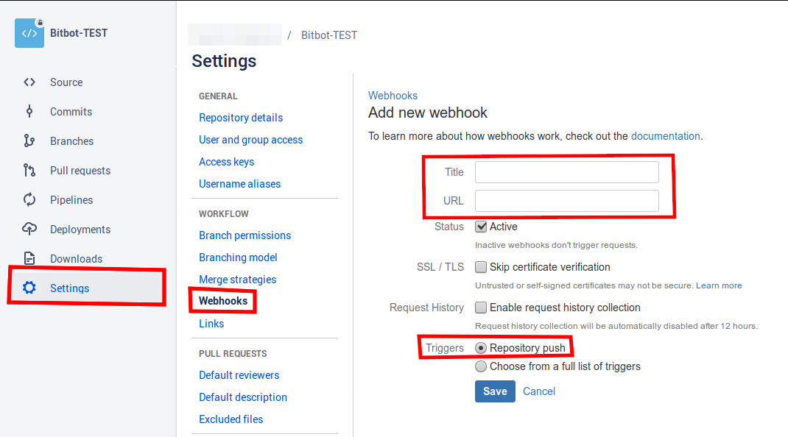
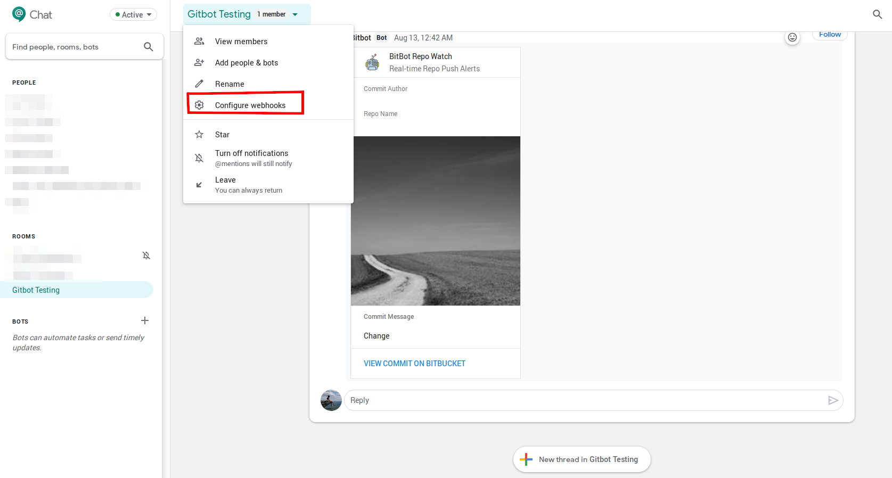
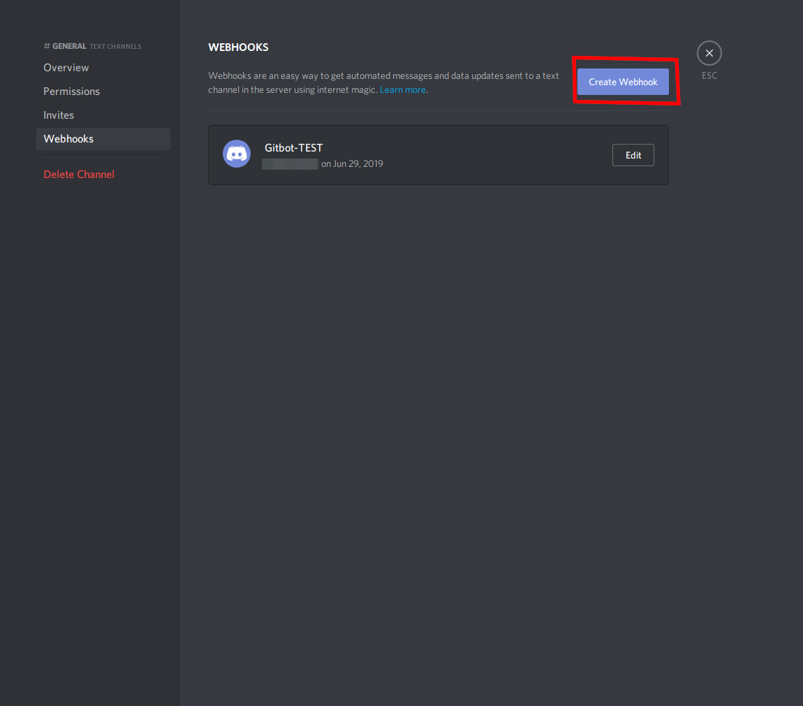

# Bitbot

#### A Python based alert bot for source pushes.

## Overview

This bot will create a message in the specified chats to alert other team memebers when a "push" has been proformed on a specified Bitbucket respository. The chat interaction is handled by webhooks.

## Deploy

[](https://heroku.com/deploy)

> **NOTE:** When deploying to Heroku you need to set some environment variables. You can either use all of the chat integrations provided (Discord and Google Chat) or only one.

After deploying the app note the hosting url. (This can be found under the `domain` section in the settings of your Heroku application)


## Configuration

### Bitbucket

1.  Navigate to the `webhooks` section under the `settings` tab in the Bitbucket repository you would like to monitor.
2.  Select the `Add webhook` button.
3.  Enter a title for the webhook.
4.  In the `URL` field paste the hosting url of you Heroku app (this is the url we noted above).
5.  Ensure that `Triggers` is set to **Repository push**.
    

### Google Chat

1.  Once signed into Google Chat select the menu of the chat in which you want the bot's messages to be sent to.
2.  Select the `Configure webhooks option`
    
3.  Once there type the a name for the bot and click **save**.
4.  You will now be presented with the created webhook and its url. Copy this url.
    > **NOTE:** This webhook URL is the link you will need to provide as the environment variable value for `GOOGLE_CHAT_WEBHOOK` in the Heroku app you deployed if you want the notifications to be sent to your Google Chat.

### Discord

1.  Select the settings menu for the text channel that you want to have the bot send messages to.
2.  Select the `Create Webhook` button and name the bot.
    
3.  Copy the webhook url.
4.  Once finished click the **save** button.
    > **NOTE:** This webhook URL is the link you will need to provide as the environment variable value for `DISCORD_CHANNEL_WEBHOOK` in the Heroku app you deployed if you want the notifications to be sent to your Discord Channel.

## Run

If you run the service locally using either of the two methods you will need to add your webhook urls to the `.env` file. This file will be automatically read by the Herkou CLI tool when using the `heroku local` command. See the [docs](https://devcenter.heroku.com/articles/heroku-local#copy-heroku-config-vars-to-your-local-env-file) for more details.

#### Locally

After cloning the repo simply run:

```
$ heroku local web
```

This will start the Heroku app locally on port 5000.

#### Docker (Recommended)

If you want to keep the app contained in a Docker image use the following process:

```
$ ./run.sh
```

This will create the image and place you into an interactive shell of the runnin container. Next run:

```
$ heroku local web
```

> **NOTE:** Inside of the container the application will be use port **5000**, however to the actual machine the image is running on the port being used is port **5001**.
